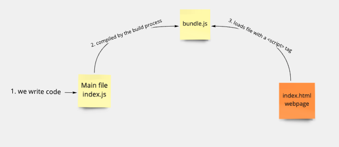
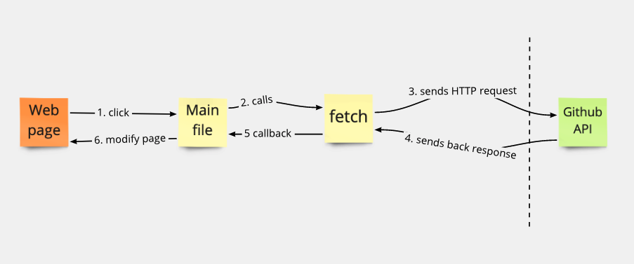

# Notes App

Make sure you also have the notes-backend-server files downloaded and running i.e. node index.js

## Fetch Diagram

This diagram recapitulates how the previous exercise works, using `fetch` to
request data from Github's API, so we can modify the page to display it. The function fetch and the JSON format can also be used to send HTTP request data to the remote server (for example, POST requests).

### File structure and separation of concerns in JS: 
source files: 
* Model class which holds data
* View class is responsible for reflecting the model's data (the list of notes) on the page (by dynamically creating HTML elements). It uses event listeners.
* Api class to fetch remote data (in this case from a backend server localhost:3000/notes)

index.js
* the main file which requires the source files
index.html
* the main file which requires the source files
